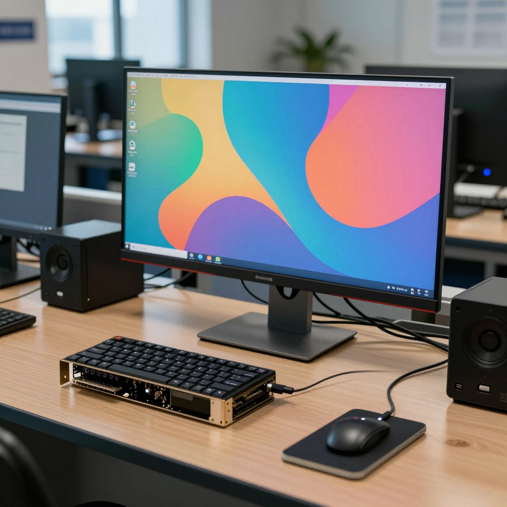

# Lecture 1 — Windows Setup, ComfyUI and Your First AI Image

**Generative AI Full Course — Lecture 1: Complete Windows & ComfyUI Setup Tutorial**

You will build an isolated Python environment, prepare Windows development tools, install ComfyUI from source and generate an image with Z-Image Turbo. You will also save the workflow, recover its settings from the original PNG, share models between installations and back up before updating.

## Download and follow along

Download the [complete companion ZIP](https://github.com/FurkanGozukara/Generative-AI-Tools-And-Tecniques-2026-2027-Fall/raw/refs/heads/main/downloads/Lecture_01_Companion_Files.zip), extract it, then open `lecture-01/README.md`. You can read the same files here on GitHub. For an individual workflow or image, use GitHub's **Download raw file** action; saving the web page is not the same as downloading the asset.

1. Follow the [Windows setup guide](Week01_Windows_Setup.md), including the [C++ component checklist](Visual_Studio_Cpp_Checklist.md).
2. Try the [Python environment-isolation exercise](Environment-commands.txt) and [C++ example](examples/README.md).
3. Run the [ComfyUI installation commands](Week01_ComfyUI_commands.txt) in a new installation folder.
4. Download the three files in the [model guide](Week01_Model_Downloads.md). Choose local folders or the shared-folder template.
5. Load [Week01_LocalModels_Proof.json](Week01_LocalModels_Proof.json), check the model selections and run it.
6. Practice [PNG and seed recovery](PNG_Workflow_Recovery.md), then follow the [backup and update guide](Week01_Backup_and_Recovery.md).

Use the [troubleshooting guide](Week01_Troubleshooting.md) when a command or workflow differs from the lecture.

The [78-chapter list](chapters.txt) follows the finished lecture timeline, so you can find the relevant section when watching the video.

## First-image workflow

The PNG above is the original generated file, including its ComfyUI metadata. Download it without converting it. The supplied JSON and PNG both use seed `170592213851282`, a 1024 × 1024 canvas and eight sampling steps. The three model filenames are listed in the [model guide](Week01_Model_Downloads.md).

The graph is based on the [official ComfyUI Z-Image Turbo example](https://docs.comfy.org/tutorials/image/z-image/z-image-turbo), with the lecture's workstation prompt and settings. Its original filename contains `Proof` so that it matches the file shown in the tutorial.

## Files in this companion

| File | Use |
|---|---|
| [Week01_Windows_Setup.md](Week01_Windows_Setup.md) | Installation order, official downloads, PATH, GPU and page-file guidance |
| [Visual_Studio_Cpp_Checklist.md](Visual_Studio_Cpp_Checklist.md) | One C++ workload and the selected optional components |
| [Environment-commands.txt](Environment-commands.txt) | Python 3.12 / 3.11 virtual-environment exercise |
| [Week01_System_Checks.txt](Week01_System_Checks.txt) | Read-only version and GPU checks, with the right terminal for each |
| [examples/hello.cpp](examples/hello.cpp), [example guide](examples/README.md) | Small compile-and-run exercise; expected sum is 42 |
| [Week01_ComfyUI_commands.txt](Week01_ComfyUI_commands.txt) | Source installation, launch, help and maintenance commands |
| [Week01_Model_Downloads.md](Week01_Model_Downloads.md) | Exact model links, filenames and storage locations |
| [extra_model_paths.yaml](extra_model_paths.yaml) | Optional shared-model configuration; edit its base path |
| [Week01_Shared_Model_Paths.txt](Week01_Shared_Model_Paths.txt) | Plain-text copy of the YAML shown in the lecture |
| [Week01_LocalModels_Proof.json](Week01_LocalModels_Proof.json) | Original saved ComfyUI workflow |
| [z-image-turbo_00002_.png](z-image-turbo_00002_.png) | Original generated image with recoverable workflow metadata |
| [PNG_Workflow_Recovery.md](PNG_Workflow_Recovery.md) | Restore the submitted seed and reload a PNG |
| [Package_downloads.md](Package_downloads.md), [FFmpeg commands](Week01_FFmpeg_commands.txt) | FFmpeg, Node.js, cuDNN and TensorRT download routes |
| [Week01_Backup_and_Recovery.md](Week01_Backup_and_Recovery.md) | Save your own configuration before maintenance |
| [Week01_Troubleshooting.md](Week01_Troubleshooting.md) | Common failures and the next useful action |
| [references/README.md](references/README.md) | Recorded package snapshots, source commits and startup help |
| [sources.md](sources.md) | Official sources and dated course references |
| [SHA256SUMS.txt](SHA256SUMS.txt) | File-integrity checksums for this companion |
| [chapters.txt](chapters.txt) | All 78 lecture chapter timestamps |

## Before you start

The command sheets follow the **Windows + NVIDIA + manual source installation** route. An NVIDIA GPU is needed to follow that GPU route; use the [official installation guide](https://docs.comfy.org/installation/manual_install) for another platform or backend. GPU memory needs depend on the workflow and model precision. The model files alone total about 20.7 GB, before Python packages, download caches and generated images.

The public examples use `C:\AI` as a short writable parent folder. You can use another drive. The lecture uses `G:\educational_videos`; replace that location consistently with your own. Keep this downloaded companion separate from the ComfyUI application folder. Copy only the workflow, models and configuration files you need into the locations described.

Use the commands as individual steps, not as an unattended installer. Stop at the first failed installation command, read its error and use the troubleshooting guide before continuing.
