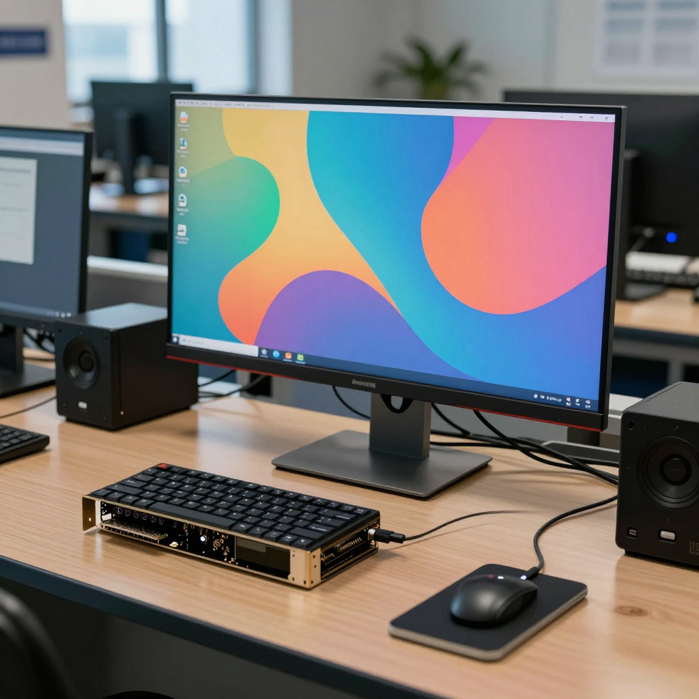

# Lecture 2 — The ComfyUI Graph and Your First Workflow

**Generative AI Full Course - Lecture 2: Build a ComfyUI Workflow from Scratch with Z-Image Turbo**

▶️ **[Watch Lecture 2](https://youtu.be/T2_z7ZaffyI)** · 📺 **[Full course playlist](https://www.youtube.com/playlist?list=PLUMEJUep1hiI)**

You will update an existing ComfyUI installation, build the image pipeline node by node, and follow the data from a written prompt to saved pixels. You will then test one control at a time — resolution, seed, sampling steps, guidance and the negative branch — and recover a complete workflow from the original PNG.

Follow [Lecture 1](../lecture-01/README.md) first if you still need the Windows setup, the installation and the three model files.

## Download and follow along

Download the [complete companion ZIP](https://github.com/FurkanGozukara/Generative-AI-Tools-And-Tecniques-2026-2027-Fall/raw/refs/heads/main/downloads/Lecture_02_Companion_Files.zip), extract it, then open `lecture-02/README.md`. You can read the same files here on GitHub. For an individual workflow or image, use GitHub's **Download raw file** action; saving the web page is not the same as downloading the asset.

1. Update your installation with the [recorded commands](update_commands.txt); check that the active Python belongs to its virtual environment.
2. Find your model files with the [model folder guide](model_paths.md); a copied model appears in the selector after refreshing the graph.
3. Build and inspect the pipeline against [the reference workflow](lecture02_workflow.json): text becomes conditioning, sampling produces a latent, and VAE Decode produces pixels for Save Image.
4. Reproduce the starting recipe from the [prompt](reference_prompt.txt) and [settings](reference_settings.md); keep the seed fixed and inspect the foreground objects as well as the monitor.
5. Read the measured [generation cost](generation_cost.md); distinguish the total prompt time from the sampling rate and from resident device memory.
6. Change one control at a time — resolution, seed, steps, guidance, the negative branch — and compare your own results, as in the lecture.
7. Drop the [original PNG](lecture02_result.png) into an empty canvas to recover the whole graph, then use ordinary Export to save it as JSON.

The [chapter guide](chapter_guide.md) and the [plain chapter list](chapters.txt) follow the finished lecture timeline, so you can find the relevant section while watching.

Read the [emoji-formatted video description](youtube_description.txt) for the full chapter list and resource links. The [published video title](youtube_title.txt) is also included as plain text.

## The reference image

The PNG above is the original generated file, including its ComfyUI metadata. Download it without converting it: an image that has been resized or processed by another service may have lost that metadata. Model weights are separate files and are not embedded in either the image or the workflow.

[`starting_workflow.png`](starting_workflow.png) is the accepted graph from Lecture 1, the starting point of this lesson.

## What the comparisons in the lecture show

The baseline has a recognizable laboratory scene, but its foreground keyboard and graphics card are fused. The four-step result separates the three-fan card more clearly for this seed. Guidance three produces stronger colors and softer detail; guidance seven severely clips and fragments the scene. These are observations about the demonstrated model, prompt and settings.

With CFG one, replacing the Zero Out branch with the encoded text `blurry, low quality, distorted shapes, oversaturated colors` produced exactly the same pixels as the reference. In this sampler configuration, CFG one skips the negative prediction; the result does not establish that negative conditioning is ineffective in other configurations.

Changing the seed and prompt together can reveal a result you prefer, but cannot identify which change caused that preference. To test the prompt, hold the seed and other settings fixed. To compare starting noise, hold the prompt and recipe fixed. An unchanged graph can reuse cached output; a repeatability test must actually run sampling again.

## Files in this companion

| File | Use |
|---|---|
| [update_commands.txt](update_commands.txt) | The update route for an existing manual installation, with the activation and `where python` checks |
| [model_paths.md](model_paths.md) | Model folders, filenames and the refresh demonstration |
| [lecture02_workflow.json](lecture02_workflow.json) | The editable graph with node layout and connections |
| [lecture02_result.png](lecture02_result.png) | Original generated image with recoverable workflow metadata |
| [starting_workflow.png](starting_workflow.png) | The Lecture 1 graph this lesson starts from |
| [reference_prompt.txt](reference_prompt.txt), [reference_settings.md](reference_settings.md) | The baseline prompt and every setting of the starting recipe |
| [generation_cost.md](generation_cost.md) | Measured timing and device memory for the two resolutions |
| [chapter_guide.md](chapter_guide.md), [chapters.txt](chapters.txt) | Chapter timestamps, with the matching file for each one |
| [youtube_description.txt](youtube_description.txt), [youtube_title.txt](youtube_title.txt) | Video description, chapters, resources and published title |
| [SHA256SUMS.txt](SHA256SUMS.txt) | File-integrity checksums for this companion |

## Before you start

The environment used for this lecture was ComfyUI commit `c194dd00cd42aa18d9dbf27d977bf6b85d9ea565`, frontend `1.53.6`, Python `3.12.10` and Torch `2.14.0+cu130`. The update demonstration moved that installation to `b0f4b7b294ce482a2e071d9d762c133d38c7aa07`. Keep model files and runtime details with any claim of exact repeatability; versions will change.

The demonstrated VAE is in a `LectureTwo` subfolder; select your own matching `ae.safetensors` if your folder layout differs. The graph is based on the [official ComfyUI Z-Image Turbo example](https://docs.comfy.org/tutorials/image/z-image/z-image-turbo), with this course's workstation prompt and settings.
